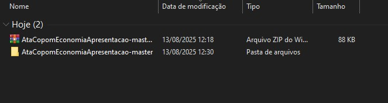
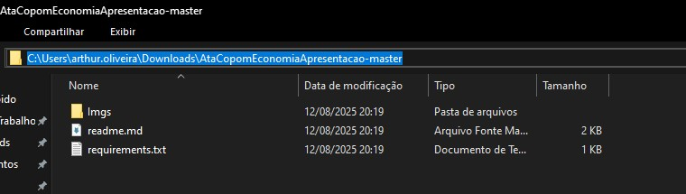
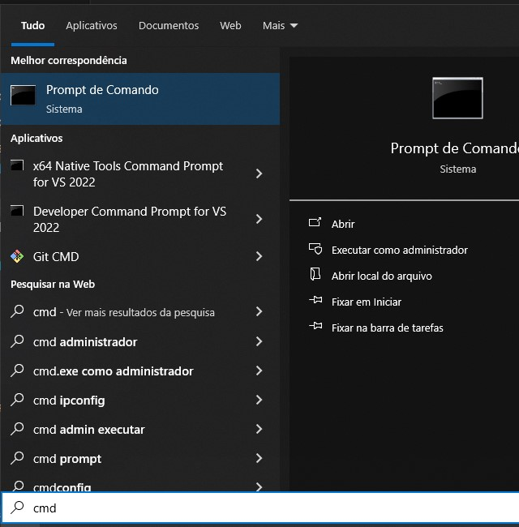
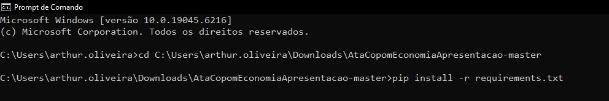
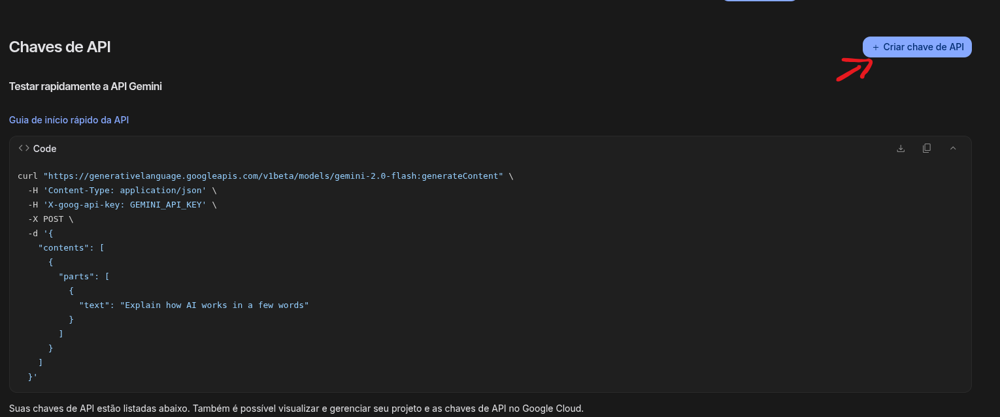
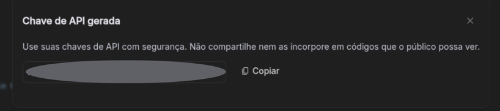
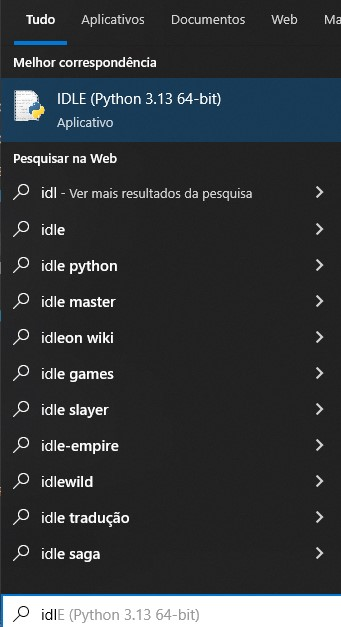
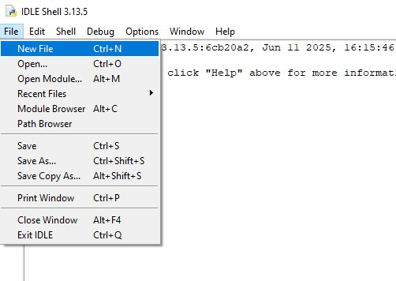
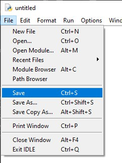
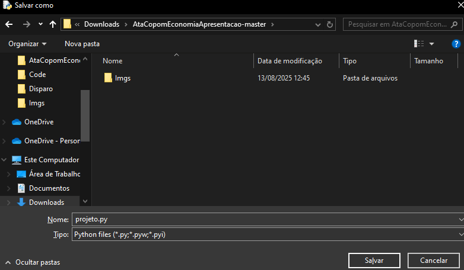

## Tutorial de como instalar e preparar o ambiente para rodar o projeto

### 1) Instalação do Python
- Baixe e instale o Python 3.10 ou superior a partir do site oficial: [Python 3.10](https://www.python.org/downloads/release/python-3100/)
    - Click no link do instalador, no nosso caso, [Windows installer (64-bit)](https://www.python.org/ftp/python/3.10.0/python-3.10.0-amd64.exe).
- Durante a instalação, certifique-se de marcar a opção "Add Python to PATH" ou "Adicione o Python ao PATH".

### 2) Download do projeto
- Entre no repositório do projeto: [ProjetoATA_COPOM](https://github.com/Arthur020104/AtaCopomEconomiaApresentacao)
- Faça o download do repositório clicando no botão "Code" e selecionando "Download ZIP". 

- Extraia o conteúdo do arquivo ZIP para uma pasta de sua escolha.
  
- Copie o caminho do arquivo no explorador de arquivos.
  
- Abra o terminal (cmd).
  
- Digite o comando cd e cole o caminho copiado, comando esperado `cd C:\caminho\para\o\projeto`. Após isso digite pip install -r requirements.txt
  

### 3) Chave da API do Gemini
- Para utilizar o modelo Gemini, você precisará de uma chave de API.
- Acesse o site [Ai Studio](https://aistudio.google.com/apikey.
- Aceite os termos de uso.
- Click no botão "Criar chave de API" para gerar sua chave.
  
- Copie a chave gerada.
  

### 4) Criando o arquivo python
- Abra o editor de arquivo padrão do python. IDLE
 
- Clique em "File" e depois em "New File" para criar um novo arquivo, ou aperte Ctrl + N.
 
- Clique em "File" e depois em "Save" para salvar o arquivo, ou aperte Ctrl + S.
 
- Selecione o diretório onde foi extraído o projeto e salve o arquivo.
 

#### 5) Executando o arquivo python
- No terminal ainda, digite `python nome_do_arquivo.py` para executar o arquivo.
- Não devemos esperar qualquer saída, pois o script inicialmente estará vazio.
##### Pronto agora siga as instruções da apresentação.