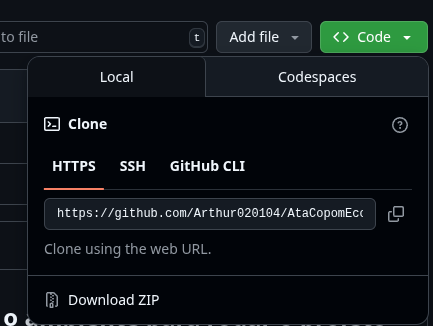

## Tutorial de como instalar e preparar o ambiente para rodar o projeto

### 1) Instalação do Python
- Baixe e instale o Python 3.10 ou superior a partir do site oficial: [Python 3.10](https://www.python.org/downloads/release/python-3100/)
    - Click no link do instalador, no nosso caso, [Windows installer (64-bit)](https://www.python.org/ftp/python/3.10.0/python-3.10.0-amd64.exe).
- Durante a instalação, certifique-se de marcar a opção "Add Python to PATH" ou "Adicione o Python ao PATH".

### 2) Download do projeto
- Entre no repositório do projeto: [ProjetoATA_COPOM](https://github.com/Arthur020104/AtaCopomEconomiaApresentacao)
- Faça o download do repositório clicando no botão "Code" e selecionando "Download ZIP". 

- Extraia o conteúdo do arquivo ZIP para uma pasta de sua escolha.
- Abra o terminal (Prompt de Comando ou PowerShell) e navegue até a pasta onde você extraiu o projeto.
    - No Windows, você pode fazer isso digitando `cd caminho\para\a\pasta` no terminal.
    - O caminho pode ser encontrado na barra superior do explorador de arquivos, por exemplo: `C:\Users\SeuUsuario\Downloads\ProjetoATA_COPOM`.

### 3) Instalação das dependências
- Apenas digite o comando `pip install -r requirements.txt` no terminal.
- Isso instalará todas as bibliotecas necessárias para o projeto.

### 4) Chave da API do Gemini
- Para utilizar o modelo Gemini, você precisará de uma chave de API.
- Acesse o site [Ai Studio](https://aistudio.google.com/apikey.
- Aceite os termos de uso.
- Click no botão "Criar chave de API" para gerar sua chave.
  
- Copie a chave gerada.
  

#### Pronto agora siga as instruções da apresentação.